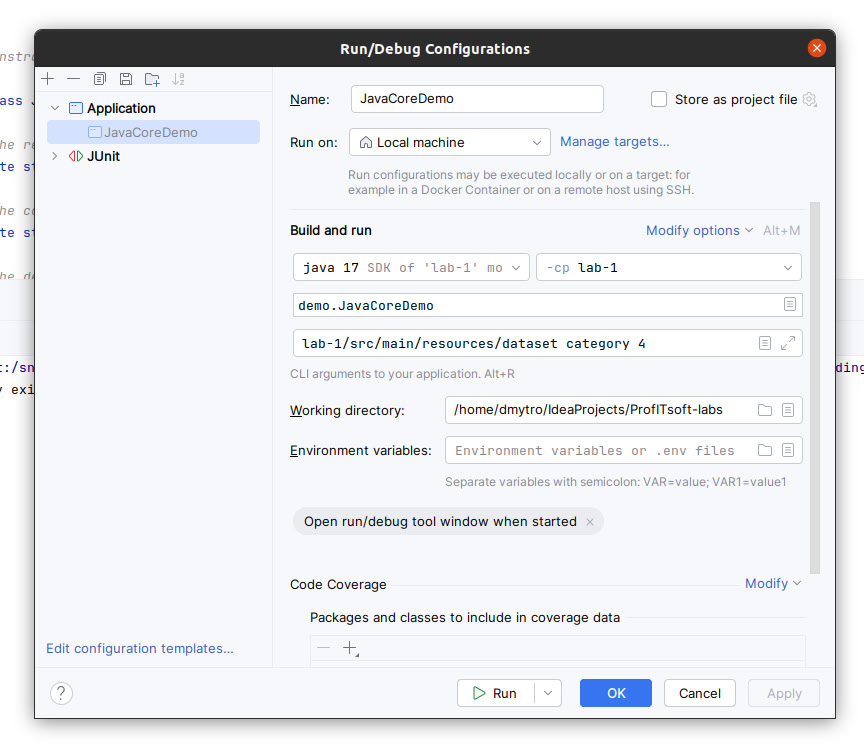

### Task Description
The objective is to develop a console program/script that parses a list of JSON files representing dishes and generates statistics (total count) based on one of their attributes. The program receives as input parameters the path to the folder containing the JSON files and the name of the attribute to generate statistics on. The program should support working with multiple attributes, with the user specifying one of them. One of the attributes should be textual and have multiple values (e.g., categories separated by commas or hashtags).


### Domain Description
This project involves the development of a console script that parses a list of JSON files representing the main entity and generates statistics based on one of its attributes. The main entity, "Dish," has several attributes such as name, description, price, calories, weight, category, ingredients, cuisines, and dietary specifics. Additionally, there is a secondary entity, "Category," which relates to the main entity in a many-to-one relationship.


### Input and Output Files
Input JSON Format:
````
{
"name": "Chocolate Cake",
"description": "Decadent chocolate cake topped with chocolate ganache.",
"price": 6,
"weight": 150,
"calories": 350.7,
"category": "Dessert",
"ingredients": ["Flour", "Sugar", "Cocoa Powder", "Eggs", "Butter"],
"cuisines": ["International"],
"dietarySpecifics": ["Contains Dairy", "Contains Eggs"]
}
````
### Output XML Format:
````
<?xml version="1.0" encoding="UTF-8"?>
<statistic>
    <item>
        <value>Greek</value>
        <count>433</count>
    </item>
    <item>
        <value>International</value>
        <count>433</count>
    </item>
    <item>
        <value>Italian</value>
        <count>432</count>
    </item>
</statistic>
````
### Experiment Results with Multithreading
- 1 processor: 86 ms
- 2 processors: 73 ms
- 4 processors: 55 ms
- 8 processors: 54 ms

### How to run the program?
- Step 1 : Take the Run menu
- Step 2 : Select Edit Configurations
- Step 3 : Fill the Program arguments


#### Example of arguments
````
lab-1/src/main/resources/dataset ingredients 4
````